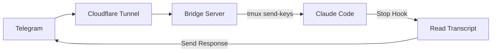

# claudecode-telegram


Telegram bot bridge for Claude Code. Send messages from Telegram, get responses back.

## How it works



1. Bridge receives Telegram webhooks, injects messages into Claude Code via tmux
2. Claude Code's Stop hook reads the transcript and sends response back to Telegram
3. Only responds to Telegram-initiated messages (uses pending file as flag)

## Install

```bash
# Prerequisites
brew install tmux cloudflared

# Clone
git clone https://github.com/hanxiao/claudecode-telegram
cd claudecode-telegram

# Setup Python env
uv venv && source .venv/bin/activate
uv pip install -e .
```

## Setup

### 1. Create Telegram bot

Bot receives your messages and sends Claude's responses back.

```bash
# Message @BotFather on Telegram, create bot, get token
```

### 2. Configure Stop hook

Hook triggers when Claude finishes responding, reads transcript, sends to Telegram.

```bash
cp hooks/send-to-telegram.sh ~/.claude/hooks/
nano ~/.claude/hooks/send-to-telegram.sh  # set your bot token
chmod +x ~/.claude/hooks/send-to-telegram.sh
```

Add to `~/.claude/settings.json`:
```json
{
  "hooks": {
    "Stop": [{"hooks": [{"type": "command", "command": "~/.claude/hooks/send-to-telegram.sh"}]}]
  }
}
```

### 3. Start tmux + Claude

tmux keeps Claude Code running persistently; bridge injects messages via `send-keys`.

```bash
tmux new -s claude
claude --dangerously-skip-permissions
```

### 4. Run bridge

Bridge receives Telegram webhooks and injects messages into Claude Code.

```bash
export TELEGRAM_BOT_TOKEN="your_token"
python bridge.py
```

### 5. Expose via Cloudflare Tunnel

Tunnel exposes local bridge to the internet so Telegram can reach it.

```bash
cloudflared tunnel --url http://localhost:8080
```

### 6. Set webhook

Tells Telegram where to send message updates.

```bash
curl "https://api.telegram.org/bot${TELEGRAM_BOT_TOKEN}/setWebhook?url=https://YOUR-TUNNEL-URL.trycloudflare.com"
```

## Bot Commands

| Command | Description |
|---------|-------------|
| `/status` | Check tmux session |
| `/clear` | Clear conversation |
| `/resume` | Pick session to resume (inline keyboard) |
| `/continue_` | Auto-continue most recent |
| `/loop <prompt>` | Start Ralph Loop (5 iterations) |
| `/stop` | Interrupt Claude |

## Environment Variables

| Variable | Default | Description |
|----------|---------|-------------|
| `TELEGRAM_BOT_TOKEN` | required | Bot token from BotFather |
| `TMUX_SESSION` | `claude` | tmux session name |
| `PORT` | `8080` | Bridge port |
